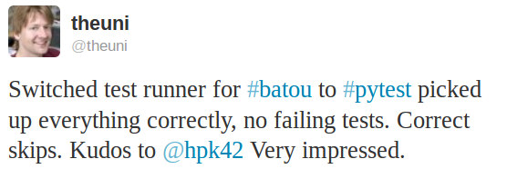

.. _projects:

.. image:: img/cramer2.png
   :width: 400px
   :align: right

.. image:: img/keleshev.png
   :width: 400px
   :align: right

Примеры проектов
==========================

Вот несколько примеров проектов, использующих ``pytest`` (пожалуйста, присылайте заметки через :ref:`contact``):

* `PyPy <http://pypy.org>`_, Python с JIT-компилятором
  `21000 tests <http://buildbot.pypy.org/summary?branch=%3Ctrunk%3E>`_
* the `MoinMoin <http://moinmo.in>`_ Wiki Engine
* `sentry <https://getsentry.com/welcome/>`_, обслуживание приложений в реальном времени и отслеживание исключений
* `Astropy <http://www.astropy.org/>`_ b `affiliated packages <http://www.astropy.org/affiliated/index.html>`_
* `tox <http://testrun.org/tox>`_, инструмент интеграции virtualenv/Hudson
* `PyPM <http://code.activestate.com/pypm/>`_ Менеджер пакетов ActiveState
* `Fom <http://packages.python.org/Fom/>`_ средство отображения Fluid объектов для FluidDB
* `applib <https://github.com/ActiveState/applib>`_ кроссплатформенные утилиты
* `six <https://pypi.org/project/six/>`_ Утилиты совместимости с Python 2 и 3
* `pediapress <http://code.pediapress.com/wiki/wiki>`_ Статьи MediaWiki
* `mwlib <https://pypi.org/project/mwlib/>`_ парсер mediawiki и служебная библиотека
* `The Translate Toolkit <http://translate.sourceforge.net/wiki/toolkit/index>`_ для локализации и конвертации
* `execnet <http://codespeak.net/execnet>`_ быстрое развертывание на нескольких Python
* `pylib <https://pylib.readthedocs.io/en/stable/>`_ кроссплатформенный путь, ввод-вывод, библиотека динамического кода
* `bbfreeze <https://pypi.org/project/bbfreeze/>`_ создание автономных исполняемых файлов из скриптов Python
* `pdb++ <https://github.com/pdbpp/pdbpp>`_ более интересная версия PDB
* `pudb <https://github.com/inducer/pudb>`_ полноэкранный консольный отладчик для Python
* `py-s3fuse <http://code.google.com/p/py-s3fuse/>`_ Файловая система на основе Amazon S3 FUSE
* `waskr <http://code.google.com/p/waskr/>`_ ПО промежуточного слоя статистики WSGI
* `guachi <http://code.google.com/p/guachi/>`_ глобальные постоянные конфигурации для модулей Python
* `Circuits <https://pypi.org/project/circuits/>`_ легковесный фреймворк Event Driven
* `pygtk-helpers <http://bitbucket.org/aafshar/pygtkhelpers-main/>`_ легкое взаимодействие с PyGTK
* `QuantumCore <http://quantumcore.org/>`_ statusmessage и repoze плагин openid
* `pydataportability <http://pydataportability.net/>`_ библиотеки для управления open web
* `XIST <http://www.livinglogic.de/Python/xist/>`_ расширяемый генератор HTML/XML
* `tiddlyweb <https://pypi.org/project/tiddlyweb/>`_ опциональное headless, расширяемое RESTful хранилище данных
* `fancycompleter <http://bitbucket.org/antocuni/fancycompleter/src>`_ для цветового завершения табуляции
* `Paludis <http://paludis.exherbo.org/>`_ инструменты для менеджера пакетов Gentoo Paludis
* `Gerald <http://halfcooked.com/code/gerald/>`_ инструмент сравнения схем
* `abjad <http://code.google.com/p/abjad/>`_ Python API для контроля Formalized Score
* `bu <http://packages.python.org/bu/>`_ микроскопическая система сборки
* `katcp <https://bitbucket.org/hodgestar/katcp>`_ Протокол связи Telescope через Twisted
* `kss plugin timer <https://pypi.org/project/kss.plugin.timer/>`_
* `pyudev <https://pyudev.readthedocs.io/en/latest/tests/plugins.html>`_ привязка чистого Python к библиотеке Linux libudev
* `pytest-localserver <https://bitbucket.org/pytest-dev/pytest-localserver/>`_ плагин для pytest, который предоставляет httpserver и smtpserver
* `pytest-monkeyplus <https://pypi.org/project/pytest-monkeyplus/>`_ плагин, расширяющий monkeypatch

Эти проекты помогают интегрировать ``pytest`` в другие фреймворки Python:

* `pytest-django <https://pypi.org/project/pytest-django/>`_ для Django
* `zope.pytest <http://packages.python.org/zope.pytest/>`_ для Zope и Grok
* `pytest_gae <https://pypi.org/project/pytest_gae/0.2.1/>`_ для Google App Engine
* Есть `some work <https://github.com/Kotti/Kotti/blob/master/kotti/testing.py>`_ в процессе разработки Kotti, CMS, построенной на PyramidPylons

Некоторые организации, при использовании pytest
-------------------------------------------------

* `Square Kilometre Array, Cape Town <http://ska.ac.za/>`_
* `Some Mozilla QA people <https://www.theautomatedtester.co.uk/blog/2011/pytest_and_xdist_plugin/>`_ использование pytest для распространения своих тестов Selenium
* `Shootq <http://web.shootq.com/>`_
* `Stups department of Heinrich Heine University Duesseldorf <http://www.stups.uni-duesseldorf.de/projects.php>`_
* cellzome
* `Open End, Gothenborg <http://www.openend.se>`_
* `Laboratory of Bioinformatics, Warsaw <http://genesilico.pl/>`_
* `merlinux, Germany <http://merlinux.eu>`_
* `ESSS, Brazil <http://www.esss.com.br>`_
* и многие другие ... (пожалуйста, будьте так добры, отправьте заметку через :ref:`contact`)
